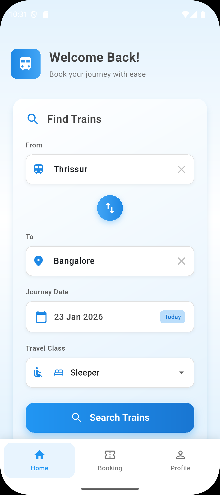
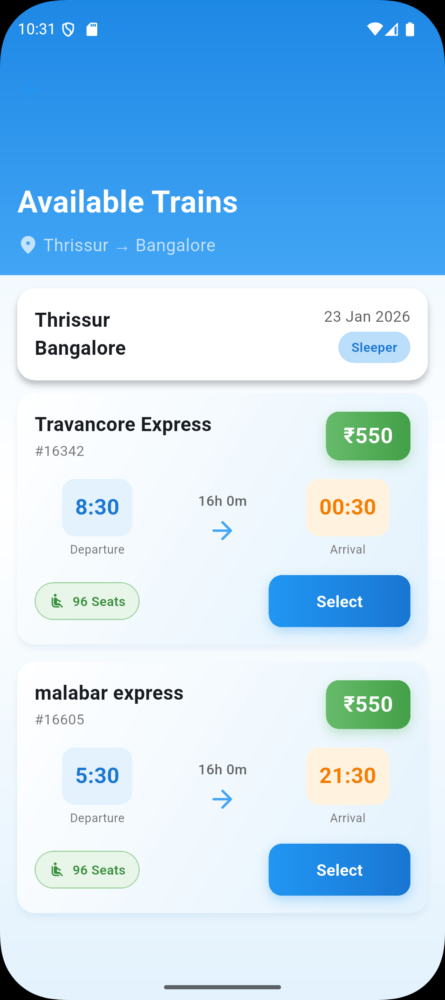
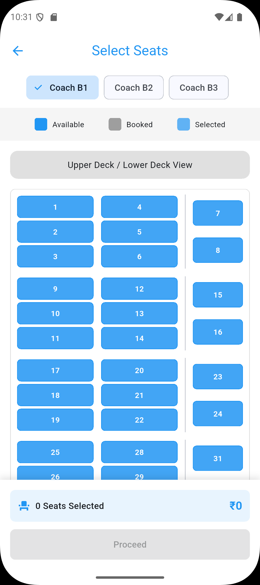
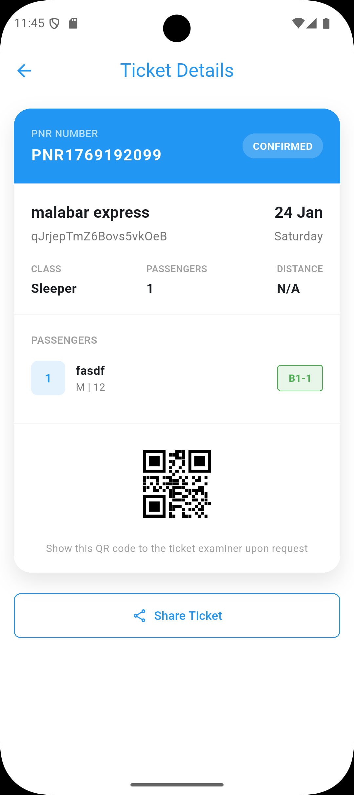
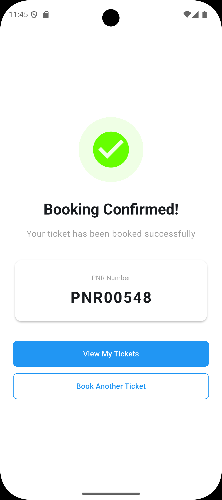
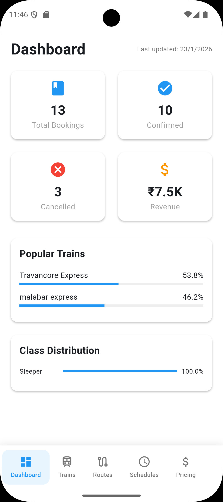
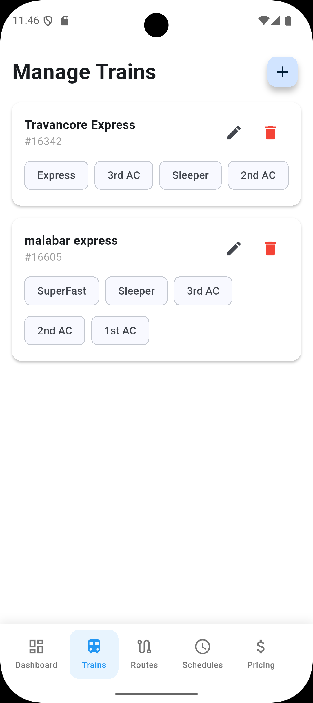
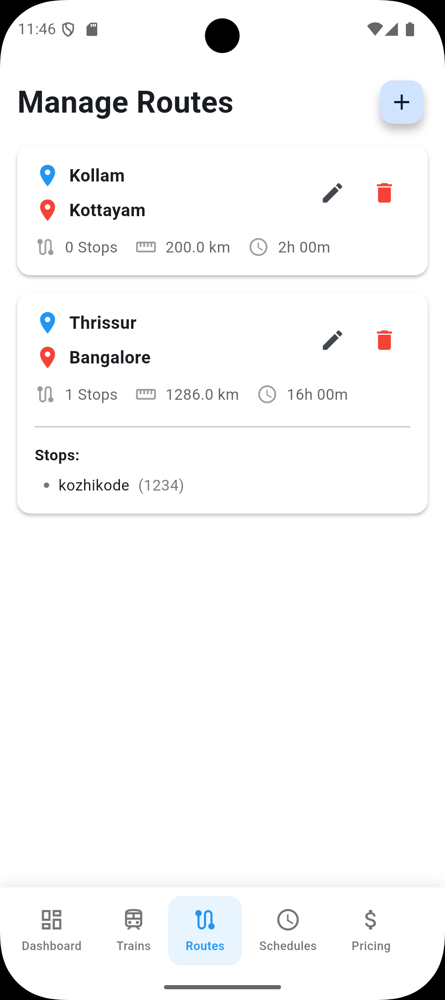
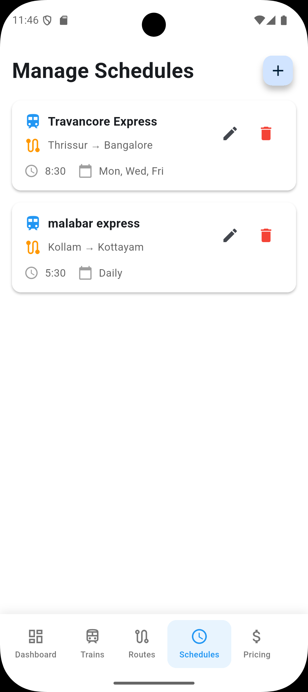
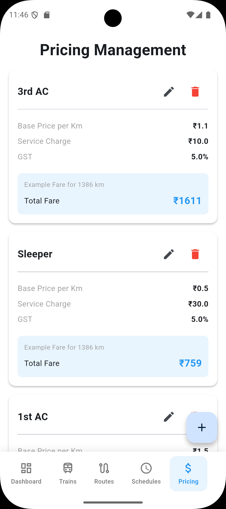

# 🚆 Railzo

<p align="center">
  <b>Modern Railway Ticket Booking & Management System built with Flutter + Firebase + Stripe</b><br>
  Search trains • Select seats • Book tickets • Secure payments • Admin dashboard
</p>

---

## ✨ Overview

Railzo is a full-stack railway ticket booking application that allows users to search trains, check real-time seat availability, select seats, and book tickets with secure online payments.

The system also includes a powerful Admin Dashboard for managing trains, routes, schedules, and pricing.

Built with clean MVVM architecture and scalable Firebase backend services.


---

## 🚆 User App

| Home | Train Search |
|-------|-------------|
|  |  |

| Seat Selection | Payment |
|--------------|---------|
|  |  |

| Booking Confirmation |
|---------------------|
|  |

---

## 🛠 Admin Panel

| Dashboard | Manage Trains |
|-----------|---------------|
|  |  |

| Routes Management | Schedule Setup |
|-------------------|----------------|
|  |  |

| Pricing Control |
|----------------|
|  |

---

# ✨ Features

## 👤 User
- Search trains between stations
- Real-time seat availability
- Seat selection
- Online ticket booking
- Secure Stripe payments
- Booking confirmation
- Firebase Authentication
- Fast and responsive UI

## 🛠 Admin
- Dashboard analytics
- Create & manage trains
- Create routes & stops
- Manage schedules
- Dynamic ticket pricing
- Manage bookings
- Real-time database updates

---

# 🔑 Admin Demo Credentials

Use the following credentials to access the admin panel:

```
Email: admin@gmail.com
Password: root@123
```

⚠️ These are demo credentials for testing only.

---

# 🛠 Tech Stack

## Frontend
- Flutter
- Dart
- Riverpod

## Architecture
- MVVM (Model–View–ViewModel)

## Backend & Services
- Firebase Authentication
- Cloud Firestore
- Firebase Storage
- Stripe Payment Gateway

---

# 🧩 Architecture Flow

UI → ViewModel → Repository → Firebase / Stripe APIs

---

# 📂 Folder Structure

```
lib/
 ├── models/
 ├── views/
 ├── viewmodels/
 ├── services/
 ├── repositories/
 └── core/
```

---

# 🚀 Getting Started

## Clone repository
```
git clone https://github.com/your-username/railzo.git
cd railzo
```

## Install dependencies
```
flutter pub get
```

## Run the app
```
flutter run
```

---

# 🔐 Environment Setup

Add your own:
- Firebase configuration files
- Stripe publishable key

⚠️ Never commit secret keys or production credentials to GitHub.

---

# 👨‍💻 Author

**Salman Noushad**  
Flutter Developer | Full Stack Builder  

GitHub: https://github.com/your-username

---

# ⭐ Support

If you like this project, consider giving it a star ⭐
